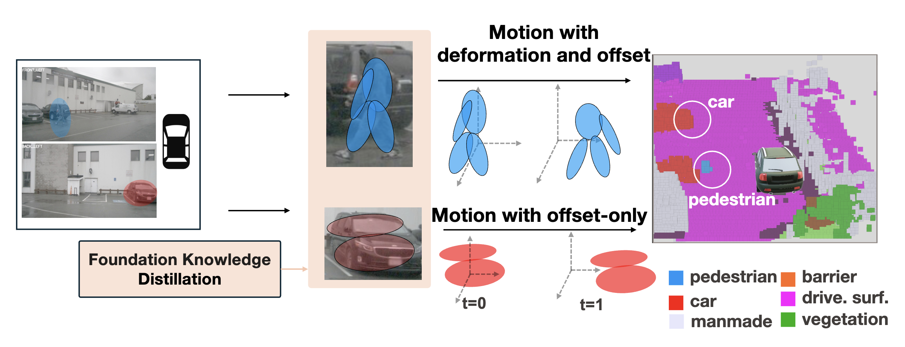

<div align="center">

<h1>Deformable Gaussian Occupancy:<br>Decoupling Rigid and Nonrigid Motion with Factorized Distillation</h1>

<p><strong>Yang Gao, Wuyang Li, Po-Chien Luan, Alexandre Alahi</strong></p>

<p><em>IEEE/CVF Conference on Computer Vision and Pattern Recognition (CVPR), 2026</em></p>

<p>
  [<a href="https://arxiv.org/abs/2605.28587">Paper</a>]
  [<a href="assets/poster_DeGO.pdf">Poster</a>]
  [<a href="https://www.youtube.com/watch?v=yFYYHu9xWYg">Video</a>]
</p>



</div>

## Demo

<p align="center">
  
</p>

## Repository Layout

```text
configs/        Release training and evaluation config
groundedsam/    GroundingDINO + SAM semantic pseudo-label generation
mmdet3d/        DeGO model, dataset, pipeline, and hook code
requirements/   Runtime dependency pins
scripts/        Setup, pseudo-label, train, and eval entry points
tools/          Training, evaluation, VGGT cache, and nuScenes info tools
vggt/           Local VGGT implementation used by cache generation
```

## Environment

The validated CUDA image is:

```text
nvidia/cuda:11.3.1-cudnn8-devel-ubuntu20.04
```

Create the CUDA 11.3 conda environment:

```bash
./scripts/setup_env_cu113.sh
```

Activate it manually:

```bash
source /path/to/miniconda3/etc/profile.d/conda.sh
conda activate dego_cu113
```

## Data

The repo expects nuScenes, occupancy ground truth, pseudo labels, dataset info
files, and the VGGT cache under `data/`.

Expected paths:

```text
data/nuscenes
data/gts
data/grounded_sam_nusc
data/metric_3d_nusc
data/vggt_cache_spatial_temporal_block22
data/bevdetv2-nuscenes_infos_train.pkl
data/bevdetv2-nuscenes_infos_val.pkl
```

To regenerate nuScenes info files when needed:

```bash
python tools/create_data_bevdet.py \
  --root-path data/nuscenes \
  --out-dir data \
  --version v1.0-trainval
```

## Pseudo Labels

We follow GaussianFlowOcc to process Nuscenes data and generate pseudo depth/segmentation labels.

Generate Metric3D depth pseudo labels:

```bash
./scripts/generate_metric3d_depth.sh
```

Generate GroundingDINO + SAM semantic masks:

```bash
SAM_CHECKPOINT=ckpts/sam_vit_h_4b8939.pth \
./scripts/generate_groundedsam_masks.sh
```

Generate the VGGT block-22 spatial-temporal feature cache:

```bash
./scripts/generate_vggt_cache.sh
```

## Training

Default four-GPU release training:

```bash
./scripts/train_release_4gpu.sh
```

Useful overrides:

```bash
CONFIG=configs/dego_30e_vggt_after20.py \
WORK_DIR=work_dirs/dego_30e_vggt_after20_release \
GPUS=4 PORT=29500 AUTO_RESUME=1 \
./scripts/train_release_4gpu.sh
```

Equivalent direct command:

```bash
PORT=29500 bash tools/dist_train.sh \
  configs/dego_30e_vggt_after20.py \
  4 \
  --work-dir work_dirs/dego_30e_vggt_after20_release \
  --auto-resume
```

## Evaluation

Evaluate one checkpoint:

```bash
CHECKPOINT=work_dirs/dego_30e_vggt_after20_release/epoch_30_ema.pth \
./scripts/eval_release.sh
```

Equivalent direct command:

```bash
python tools/test.py \
  configs/dego_30e_vggt_after20.py \
  work_dirs/dego_30e_vggt_after20_release/epoch_30_ema.pth \
  --eval mIoU \
  --nbh 5
```

## Acknowledgements

This work builds on the following projects:

- [GaussianFlowOcc](https://github.com/boschresearch/GaussianFlowOcc)
- [OpenMMLab](https://github.com/open-mmlab)

## Citation

```bibtex
@inproceedings{gao2026deformable,
  title={Deformable Gaussian Occupancy: Decoupling Rigid and Nonrigid Motion with Factorized Distillation},
  author={Gao, Yang and Li, Wuyang and Luan, Po-Chien and Alahi, Alexandre},
  booktitle={The IEEE/CVF Conference on Computer Vision and Pattern Recognition 2026},
  year={2026}
}
```
